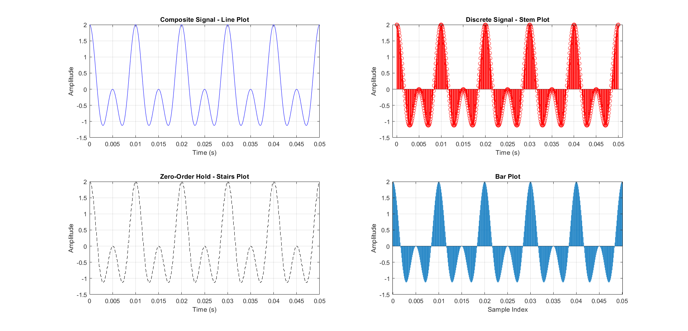

# Lab 1 - Composite Signal Analysis

Implementation of composite signal analysis with multiple visualization methods and statistical characterization.

## 📝 Tasks
1. **Composite Signal Generation**  
   - Two cosine components (100 Hz + 200 Hz)
   - Sampling frequency: 10 kHz

2. **Visualization Methods**  
   - Line plot
   - Stem plot (discrete representation)
   - Stairs plot (zero-order hold)
   - Bar chart

3. **Statistical Analysis**  
   - Mean, Variance, Standard Deviation
   - Signal-to-Noise Ratio (SNR)
   - Coefficient of Variation (CV)

## 📊 Results


**Statistical Summary**:
```
Mean: 0.0040
Variance: 1.0080
Standard Deviation: 1.0040
Signal-to-Noise Ratio (SNR): 0.0040
Coefficient of Variation (CV): 251.4980
```
