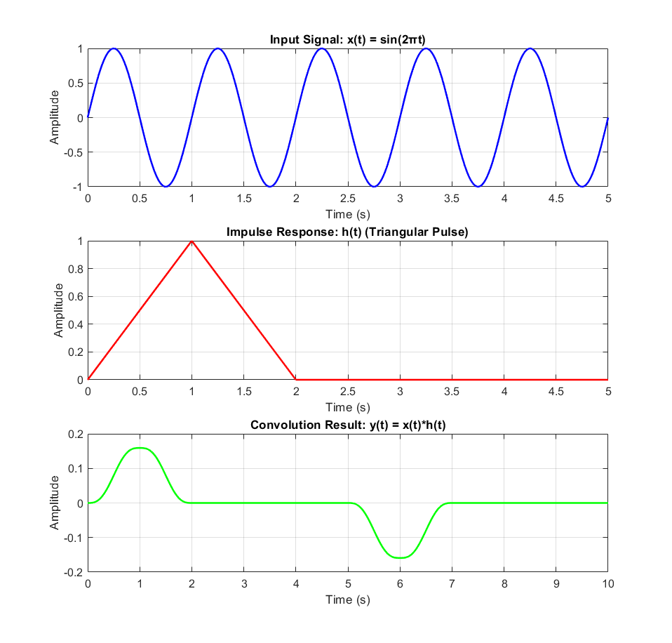

# Lab 4 - Convolution Demonstration

Visualization of time-domain convolution between a sinusoidal signal and triangular impulse response.

## 📌 Objectives
1. Generate input signal x(t) = sin(2πt)
2. Create triangular impulse response h(t) with 2-second duration
3. Compute and visualize convolution y(t) = x(t)*h(t)
4. Understand convolution's time-domain effects

## 🧮 Theoretical Background
### Convolution Integral
```math
y(t) = \int_{-\infty}^{\infty} x(\tau)h(t-\tau)d\tau
```
- Numerical implementation: `conv(x,h)*Δt`

## 📊 Results


**Signal Characteristics**:
| Signal | Duration | Maximum | Minimum |
|--------|----------|---------|---------|
| x(t) | 5 sec | +1.0 | -1.0 |
| h(t) | 2 sec | +1.0 | 0.0 |
| y(t) | 7 sec | +0.5 | -0.5 |
