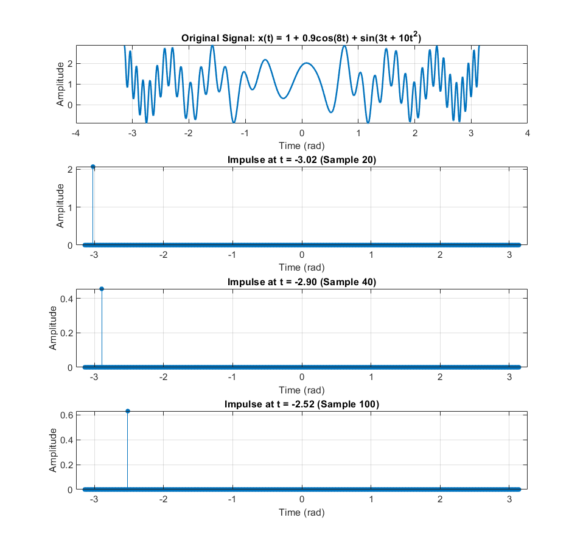
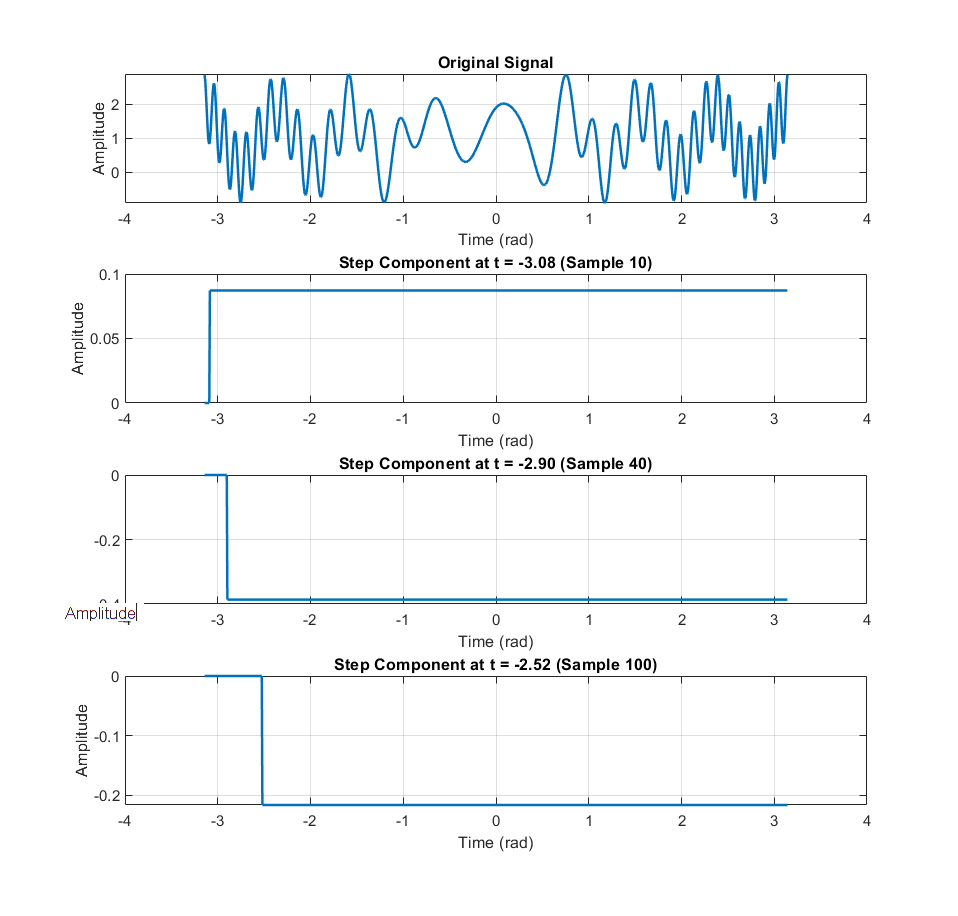
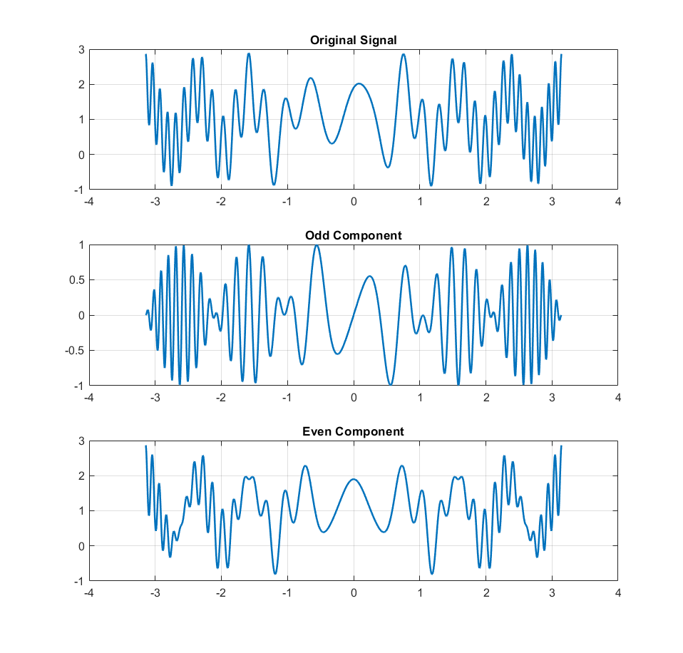
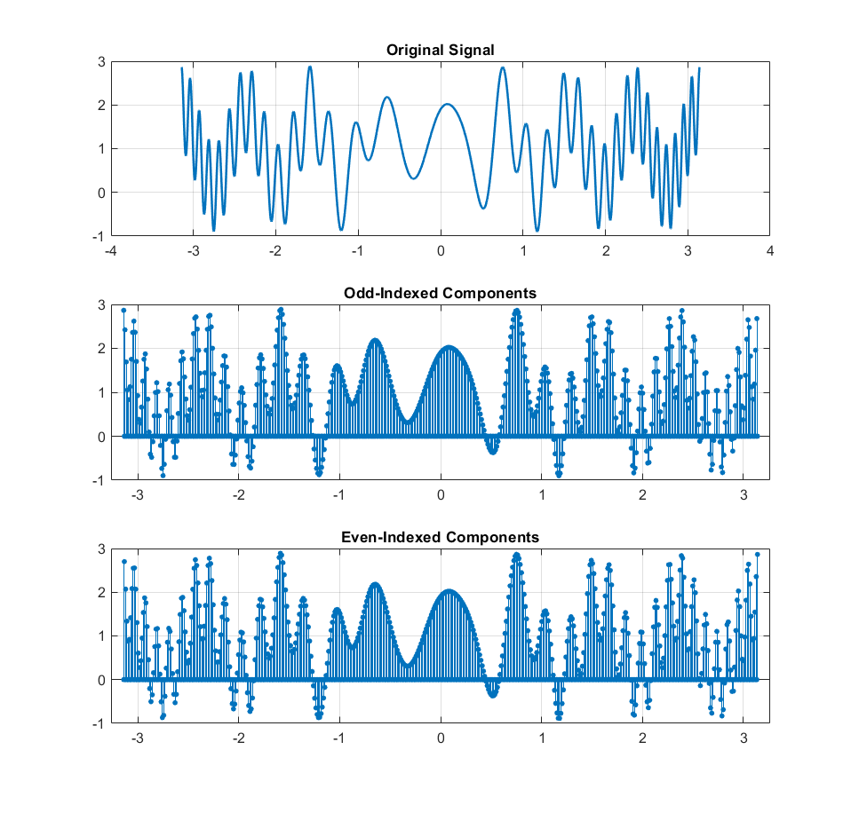

# Lab 5 - Signal Decomposition Analysis

Four fundamental signal decomposition techniques demonstrated on a composite waveform.

## 📌 Objectives
1. Analyze signal: $x(t) = 1 + 0.9\cos(8t) + \sin(3t + 10t^2)$
2. Implement decomposition methods:
   - Impulse decomposition at samples 20, 40, 100
   - Step decomposition at samples 10, 40, 100
   - Odd/Even symmetry decomposition
   - Interlaced (odd/even indexed) decomposition

## 🧮 Theoretical Background
### Decomposition Types
1. **Impulse**:
   ```math
   x(t) = \sum_{n} x[n]\delta(t-n)
   ```
2. **Step**:
   ```math
   x(t) = x(0) + \sum_{n} \Delta x[n]u(t-n)
   ```
3. **Odd/Even**:
   ```math
   x_{even}(t) = \frac{x(t)+x(-t)}{2}, \quad x_{odd}(t) = \frac{x(t)-x(-t)}{2}
   ```

## 📊 Results
### Impulse Decomposition


### Step Decomposition


### Odd/Even Decomposition


### Interlaced Decomposition


## 🔍 Key Observations
1. **Impulse Decomposition**:
   - Extracts instantaneous signal values at specific points
   - Confirms signal's amplitude at critical locations

2. **Step Decomposition**:
   - Reveals signal changes at selected points
   - Shows cumulative effect of differences

3. **Odd/Even Analysis**:
   - Original signal contains both odd and even components
   - Even part dominates due to constant and cosine terms

4. **Interlaced Decomposition**:
   - Demonstrates signal's behavior at alternate samples
   - Shows sufficient information is preserved in half-samples
