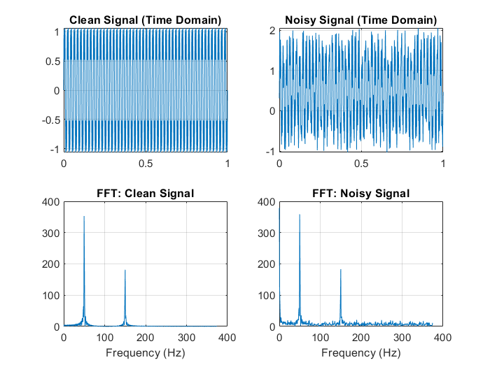
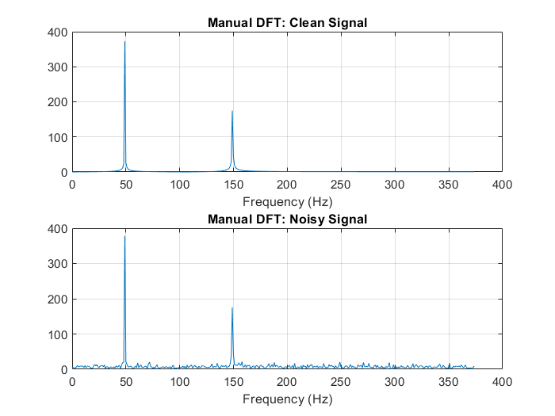

# Lab 6 - DFT Analysis 

This lab demonstrates Discrete Fourier Transform (DFT) analysis using both built-in FFT and manual calculation methods.

## 📌 Objectives
1. Generate a signal with two frequency components (50 Hz and 150 Hz)
2. Compare clean vs noisy signals in time and frequency domains
3. Implement DFT using:
   - MATLAB's built-in `fft()` function
   - Manual calculation with nested loops
4. Verify proper sampling according to Nyquist criterion

## 🧮 Key Parameters
```matlab
f1 = 50;    % First frequency component (Hz)
f2 = 150;   % Second frequency component (Hz)
f_sampling = 750; % Sampling frequency (5×f_max)
```

## 📊 Generated Figures

### Figure 1: FFT Analysis

- **Top Left**: Clean signal in time domain
- **Top Right**: Noisy signal in time domain
- **Bottom Left**: FFT of clean signal
- **Bottom Right**: FFT of noisy signal

### Figure 2: Manual DFT Analysis

- **Top**: Manual DFT of clean signal
- **Bottom**: Manual DFT of noisy signal

## 🔍 Observations
- Both methods show peaks at 50 Hz and 150 Hz
- Noise appears as increased magnitude across all frequencies
- Manual DFT results match FFT results but with lower resolution
- The 2:1 amplitude ratio between components is maintained


## 📚 Theory
DFT formula (manual implementation):
```math
X[k] = \sum_{n=0}^{N-1} x[n] \cdot e^{-j2\pi kn/N}
```

Nyquist criterion:
```math
f_s > 2f_{max}
```
